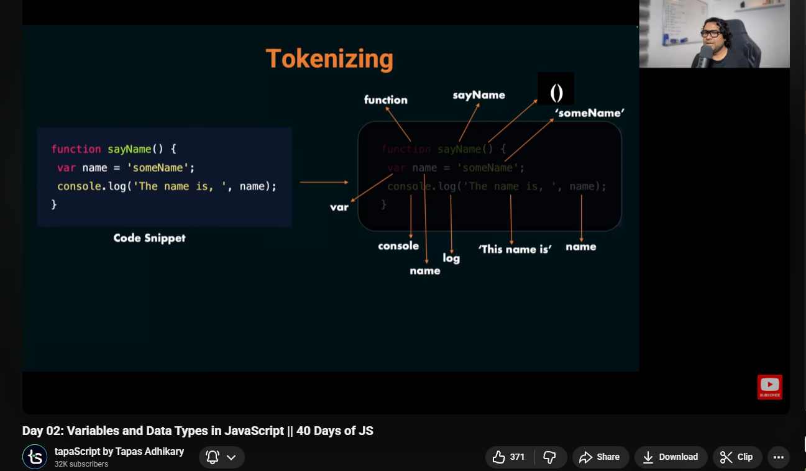
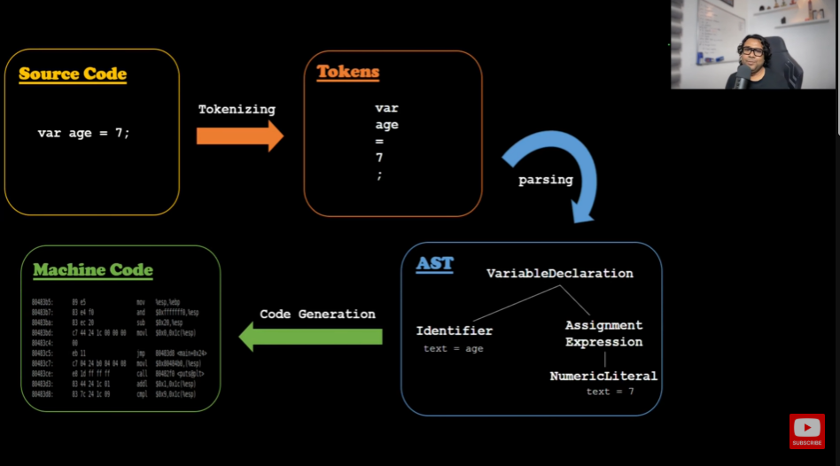

# when javascript see the code

when Javascript see the code ,Its take the code throw three main pahses (sometimes described as four steps) . Beacuse javascript dosent execute directly .It first process .
**1.Tokenizing (or Lexical Analysis)**
**2.Parsing**
**3.Interpreting**
**4.Third is called also code generation**

### 1. Tokenizing

The javacript breaks the code into the small pieces / chunks called tokens .

### 2. Parsing

The engine takes all those tokens and builds a structure called an **Abstract syntax tree (AST)**.
This tree represents the srtucture and realtionship in your code
[Visualize AST](https://astexplorer.net/)

### 3. Interpreting

The Javascript engine now interprets or translate or genarate the AST into the machine code .
Sometimes this takes two steps
1 . interpreting (ব্যাখ্যা) : Running line by line
2 . code generation : Converting to optimized machine code

#### Namaste JavaScript Ep. 16

[JavaScript execution process explained behind the scenes](https://youtu.be/2WJL19wDH68?si=_qzi01KJF9bpi_sw)
